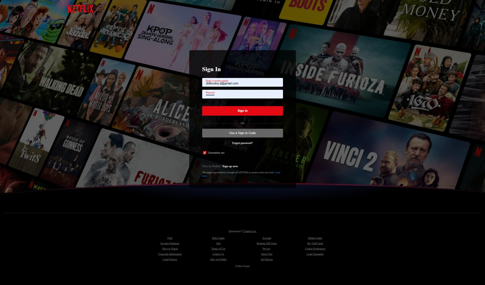
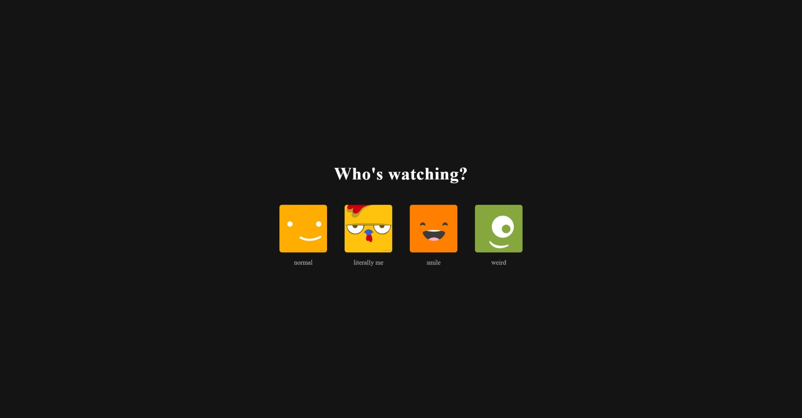
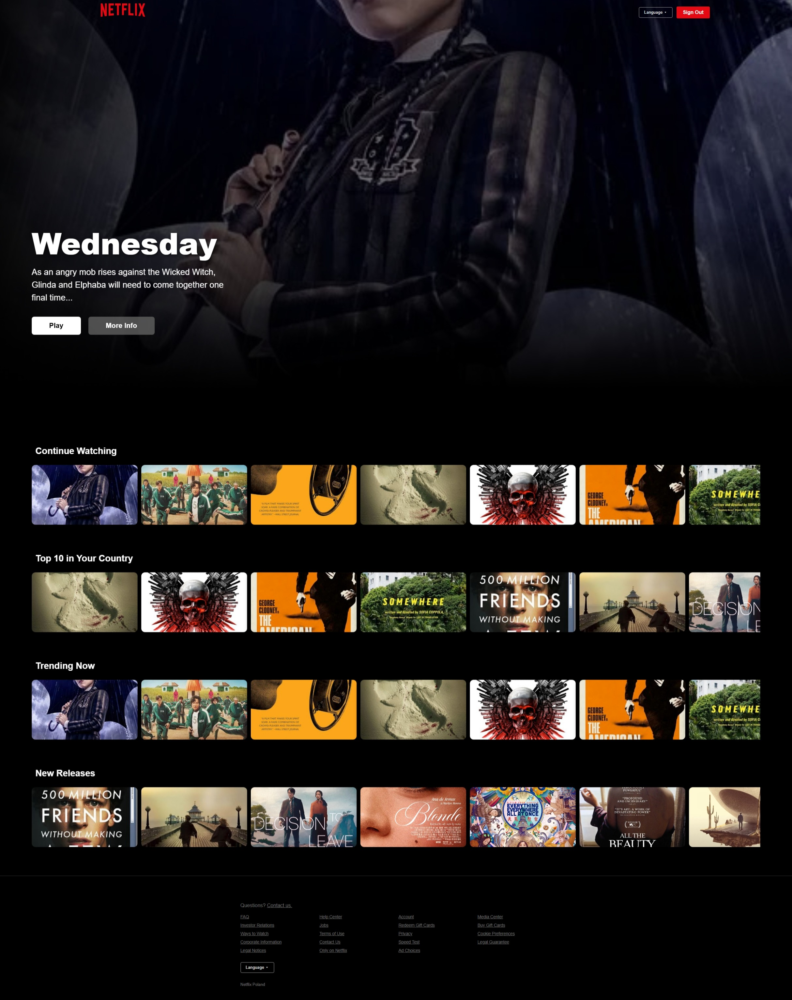
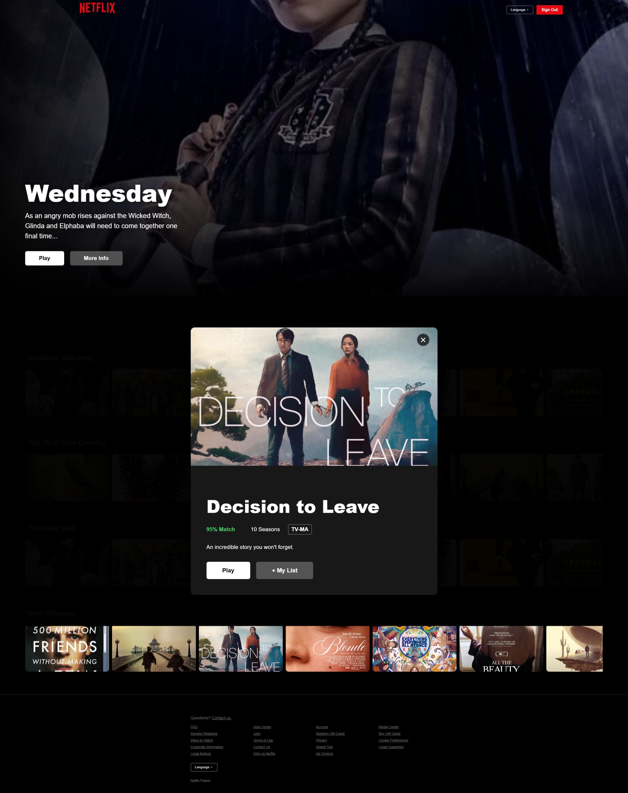
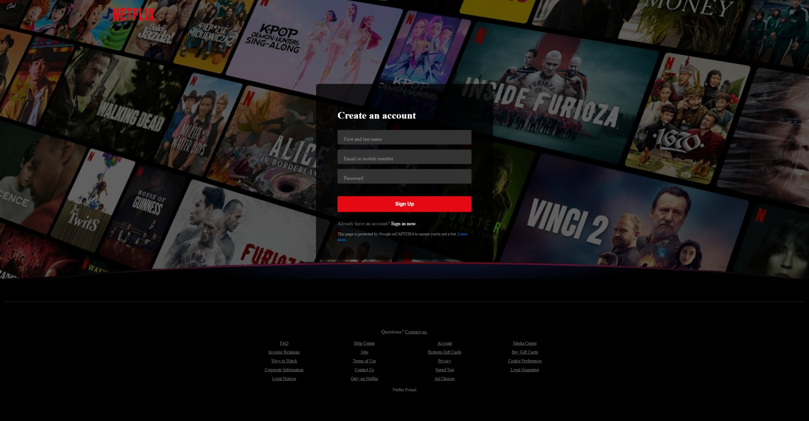
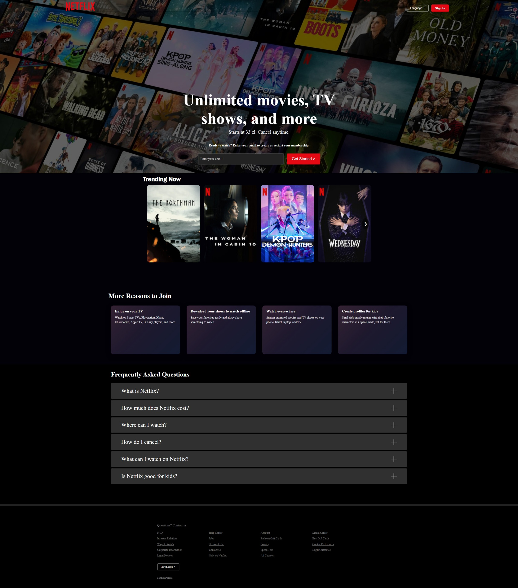

# Netflix Clone  
**A modern, full-stack Netflix clone with authentication, profile selection, and a dynamic browsing experience.**

  
*Beautiful UI, smooth animations, and responsive design — just like the real Netflix.*

---

## Features

- **User Authentication** – Register and log in with email/password (bcrypt hashing)
- **Profile Selection** – Choose from multiple profiles with avatars
- **Browse Page** – Hero banner, horizontal carousels, hover effects, and modal details
- **Sign Out** – Secure logout with session cleanup
- **Responsive Design** – Works perfectly on mobile, tablet, and desktop
- **Smooth Animations** – Fade-ins, slide-ups, hover scales, and modal transitions
- **Clean Codebase** – React + Express + MongoDB with modern best practices

---

## Tech Stack

| Layer       | Technology                          |
|------------|-------------------------------------|
| Frontend   | React 18, React Router v6, Vite     |
| Backend    | Node.js, Express.js                 |
| Database   | MongoDB (Mongoose)                  |
| Styling    | CSS3 (no external libraries)        |
| Auth       | bcryptjs, localStorage (session)    |
| Hosting    | Local / Deployable (Vercel, Render) |

---

## Project Structure

```
netflix-clone/
├── backend/
│   ├── controllers/     # Auth logic
│   ├── models/          # User schema
│   ├── routes/          # API endpoints
│   └── server.js        # Express server
├── frontend/
│   ├── src/
│   │   ├── components/  # Navbar, Footer, etc.
│   │   ├── pages/       # Browse, Profiles, SignIn
│   │   ├── assets/      # Images, icons
│   │   └── App.jsx, main.jsx
│   └── vite.config.js
├── .env                 # Environment variables
└── README.md
```

---

## Getting Started

### Prerequisites
- Node.js (v16+)
- MongoDB (local or Atlas)
- Git

### Installation

1. **Clone the repository**
   ```bash
   git clone https://gitlab.com/danil.didkivskiy/netflix-clone.git
   cd netflix-clone
   ```

2. **Set up environment variables**
   ```bash
   # Create .env in root
   cp .env.example .env
   ```
   Edit `.env`:
   ```env
   MONGO_URI=mongodb://localhost:27017/netflix-clone
   PORT=5000
   ```

3. **Start the backend**
   ```bash
   cd backend
   npm install
   npm start
   ```
   Server runs on `http://localhost:5000`

4. **Start the frontend**
   ```bash
   cd ../frontend
   npm install
   npm run dev
   ```
   App runs on `http://localhost:5173`

---

## API Endpoints

| Method | Endpoint             | Description        |
|--------|----------------------|--------------------|
| POST   | `/api/auth/register` | Create new user    |
| POST   | `/api/auth/login`    | Login user         |

---

## Screenshots

| Feature | Preview |
|-------|--------|
| Login |  |
| Profiles |  |
| Browse |  |
| Modal |  |
| SignUp |  |
| LandingPage |  |


---

## Future Improvements

- [ ] TMDB API integration for real movie data
- [ ] Video player with playback
- [ ] User watch history & recommendations
- [ ] Dark/light mode toggle
- [ ] Deploy to Vercel + Render

---

## Contributing

Contributions are welcome! Feel free to:
- Open issues
- Submit pull requests
- Suggest features

---

## License

This project is licensed under the **MIT License** – see the [LICENSE](LICENSE) file for details.

---

## Author

**Danil Didkivskiy**  
[GitLab](https://gitlab.com/iPandoralica) | [LinkedIn](https://www.linkedin.com/in/danil-didkivskiy-5515a4365/)

> *"Built with passion, powered by code."*

---

**Star this repo if you liked it!**  
Let’s build the future of streaming together.